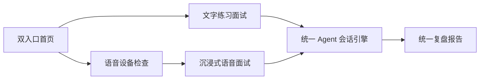

# 首页双入口与沉浸式语音面试重构计划暨交接文档

建议实施时保存为：

`docs/HOME_AND_IMMERSIVE_VOICE_REFACTOR_HANDOFF.md`

文档状态：待实施  
目标交付分支：`cys`  
调研日期：2026-07-13  
当前工作分支：`codex/agent-langgraph-foundation`  
当前 HEAD：`1a63ae7 feat(product): 完成联网研究与面试业务闭环`

## 1. 本次交接边界

本轮仅完成只读调研与重构方案设计，没有修改代码、数据库、文档、提交或远端分支。

实施时必须保护未跟踪的用户文件：

`项目周报_choice-whu_2026-07-07至2026-07-13.md`

不得暂存、修改、删除或提交该文件。

## 2. 产品目标

首页不再展示多个训练目标、最近面试、统计卡片或复杂导航，只保留两个同等重要的核心入口：

1. 文字练习面试
2. 沉浸式模拟语音面试

两种模式继续使用同一套 Agent 会话、题目生成、评分、报告和持久化能力，不创建第二套面试状态机。



## 3. 已确认的产品决策

### 3.1 首页“只留下两部分”的定义

首页业务区域只包含两个入口面板：

- 文字练习
- 沉浸语音

不再显示：

- “快速模拟”“针对 JD”“从简历练追问”等四张目标卡
- 最近面试列表
- 统计数据
- 题库、简历、历史记录的首页推广入口
- 完整侧边栏

设置、历史、简历、题库和报告功能不删除，继续保留独立路由，通过设置恢复动作、面试完成页和轻量账户菜单进入。

桌面端采用左右双面板；移动端采用上下双面板。两个面板内部允许显示简短 readiness 状态，但不得形成第三个独立区域。

### 3.2 “没有其他 UI”的定义

沉浸式语音面试进行中不得显示：

- App 侧边栏和顶部导航
- 题号、进度条、评分、研究来源
- 文字输入框
- 会话历史卡片
- 参数设置
- 报告入口
- 与当前语音交互无关的按钮

仍须保留必要的安全和无障碍反馈：

- 中央声音状态视觉体
- “面试官正在说话 / 正在聆听 / 正在思考”等简短状态
- 可选实时字幕
- 暂停和退出入口
- 麦克风、断线、服务错误的恢复动作

控制项默认弱化或自动淡出，鼠标移动、触摸或键盘操作时再显示。不能为了“零 UI”而让用户失去退出、暂停和错误恢复能力。

### 3.3 模式职责

文字模式定位为“练习”：

- 允许思考、编辑和保存草稿
- 支持 JD、简历、专项能力和题库上下文
- 强调逐题作答和面试后复盘
- 创建失败必须保留表单内容

语音模式定位为“模拟”：

- 开始前完成模型、ASR、TTS、麦克风和网络检查
- 开始后自动完成出题、播报、收音、转写和追问
- 不在面试中展示评分
- 网络波动时优先自动恢复
- 语音不可用时允许切换文字模式，不创建旧状态机 fallback

## 4. 当前代码基线

现有基础已经具备：

- Agent readiness 与可操作恢复动作
- PostgreSQL Checkpointer 和显式本地 MemorySaver
- 文本回答草稿与恢复
- Agent 会话暂停、继续、删除和报告
- Qwen 实时语音 WebSocket、PCM 音频上传、ASR/TTS 和打断
- Tavily 搜索与 Wikimedia 无 Key 降级
- 研究来源、证据和评分闭环

主要问题是呈现层仍然混合：

- [interview-hub-page.tsx](C:/Users/cys/ezmock/src/features/interview-hub/components/interview-hub-page.tsx) 仍然展示四个目标和最近面试。
- [interview-agent-setup.tsx](C:/Users/cys/ezmock/src/features/interview-agent/components/interview-agent-setup.tsx) 在同一向导中切换文字和语音。
- [interview-agent-page.tsx](C:/Users/cys/ezmock/src/features/interview-agent/components/interview-agent-page.tsx) 同时承担文字、语音、研究来源、评分证据和生命周期 UI。
- 语音模式虽然隐藏了部分侧栏，但仍不是独立的沉浸式体验。
- AppShell 包裹所有 `_authenticated` 路由，语音页面无法彻底去除导航外壳。

已有实现背景继续参考：

- [PRODUCT_EXPERIENCE_REDESIGN_PLAN.md](C:/Users/cys/ezmock/docs/PRODUCT_EXPERIENCE_REDESIGN_PLAN.md)
- [PRODUCT_EXPERIENCE_IMPLEMENTATION_HANDOFF.md](C:/Users/cys/ezmock/docs/PRODUCT_EXPERIENCE_IMPLEMENTATION_HANDOFF.md)
- [NEXT_AI_PRODUCT_HANDOFF.md](C:/Users/cys/ezmock/docs/NEXT_AI_PRODUCT_HANDOFF.md)

## 5. 目标用户流程

### 5.1 文字练习

1. 用户在首页选择“文字练习面试”。
2. 进入 `/new`，页面只配置文字面试。
3. 用户选择岗位、难度、模型、简历、JD、专项能力和联网研究。
4. readiness 按当前方案检查。
5. blocked 时不发送创建请求，并提供设置、重试或联系管理员。
6. degraded 时明确提示影响，并允许关闭研究后继续。
7. 创建成功进入 `/session/:id`。
8. 用户通过多行输入框完成多轮练习。
9. 结束后进入统一报告和复练入口。

### 5.2 沉浸式语音模拟

1. 用户在首页选择“沉浸式语音面试”。
2. 进入 `/voice/new` 语音候场页。
3. 用户完成岗位等必要配置，不展示复杂高级选项。
4. 系统并行检查：
   - Agent 开关
   - 模型 Key
   - Checkpointer
   - 数据库迁移/RPC
   - ASR
   - TTS
   - 浏览器麦克风权限
   - WebSocket 连通性
   - 联网研究是否可用或可降级
5. 用户主动点击“进入面试”，以满足浏览器全屏、AudioContext 和麦克风权限必须由用户手势触发的限制。
6. 创建 voice session，进入 `/voice/session/:id`。
7. 页面请求全屏；被拒绝时退回 full-viewport，不阻断面试。
8. 面试官自动播报，系统自动监听、转写和推进会话。
9. 用户可暂停、退出或在语音服务失效时切换文字。
10. 完成后退出全屏并跳转统一报告页。

## 6. 前端重构方案

### 6.1 首页

修改：

- `src/features/interview-hub/components/interview-hub-page.tsx`
- `src/features/interview-hub/hooks/use-interview-hub.ts`
- `src/features/interview-hub/types.ts`

新增：

```text
src/features/interview-hub/
├── components/
│   ├── interview-hub-page.tsx
│   ├── interview-mode-panel.tsx
│   └── interview-home-account-menu.tsx
└── constants.ts
```

要求：

- `InterviewHubPage` 只组合两个 `InterviewModePanel`。
- readiness 只通过现有 `agent-readiness` feature 获取。
- 不在首页组件读取环境变量。
- 文字和语音 readiness 分开计算。
- blocked 面板不可直接创建会话。
- 页面动态状态使用 `aria-live="polite"`。
- 错误使用 `role="alert"`。
- 移除首页最近会话查询；历史记录仍在 `/history`。
- 首页不加载报告、题库或简历列表，降低首屏请求数量。

### 6.2 路由与 AppShell 分离

新增一个无 AppShell、但仍执行登录校验的 pathless layout：

```text
src/routes/_focus/
├── route.tsx
├── interview-hub.tsx
├── voice.new.tsx
└── voice.session.$id.tsx
```

处理方式：

- 将现有 `/_authenticated/interview-hub.tsx` 迁入 `_focus` 路由组，URL 仍保持 `/interview-hub`。
- `_focus/route.tsx` 只负责认证和 `<Outlet />`，不渲染 AppShell。
- `/voice/new` 和 `/voice/session/:id` 使用同一无导航布局。
- `/new`、文字 `/session/:id`、历史、设置和报告继续使用现有 AppShell。
- 抽取认证守卫，避免 `_authenticated` 与 `_focus` 重复实现登录逻辑。
- 重新生成 `routeTree.gen.ts`。

### 6.3 文字面试收口

修改 `interview-agent-setup.tsx`：

- 删除文字/语音模式切换。
- 固定 `interviewMode: "text"`。
- 保留当前表单草稿和创建失败恢复。
- 继续允许选择联网研究。
- 保留 JD、简历和能力方向。
- readiness blocked 时禁用创建按钮。

修改 `interview-agent-page.tsx`：

- 收口为文字会话呈现。
- 将研究来源、回答证据和报告卡片保留在文字模式。
- 如果加载到 `mode="voice"` 的旧链接，重定向到 `/voice/session/:id`，保证已有书签和恢复链接有效。

### 6.4 新建沉浸式语音 feature

```text
src/features/immersive-voice-interview/
├── api.ts
├── types.ts
├── constants.ts
├── hooks/
│   ├── use-immersive-voice-session.ts
│   ├── use-voice-device-preflight.ts
│   ├── use-fullscreen-session.ts
│   └── use-screen-wake-lock.ts
└── components/
    ├── immersive-voice-lobby.tsx
    ├── immersive-voice-room.tsx
    ├── voice-presence-orb.tsx
    ├── voice-caption.tsx
    ├── voice-emergency-controls.tsx
    └── voice-recovery-alert.tsx
```

职责：

- `api.ts` 委托现有 interview-agent 和 voice API，不复制请求逻辑。
- `use-immersive-voice-session.ts` 组合 Agent workspace、事件流和 `useAgentVoice`。
- `use-voice-device-preflight.ts` 只检查浏览器设备和权限；服务端配置仍由 readiness 判断。
- `use-fullscreen-session.ts` 处理全屏请求、退出和被系统强制退出。
- `use-screen-wake-lock.ts` 在浏览器支持时保持屏幕唤醒，不支持时静默降级。
- `voice-presence-orb.tsx` 根据 listening、speaking、processing、reconnecting 改变动画，必须支持 `prefers-reduced-motion`。
- 字幕默认可关闭，但转写错误、权限错误和恢复动作不能只依赖颜色表达。

### 6.5 语音前端状态模型

统一状态：

```text
idle
→ checking
→ requesting_permission
→ connecting
→ ready
→ interviewer_speaking
→ listening
→ processing
→ interviewer_speaking
→ completed
```

异常分支：

```text
connecting/listening/processing
→ reconnecting
→ previous_state

reconnecting
→ recovery_required
→ retry | switch_to_text | exit
```

约束：

- `turnId` 必须贯穿一次用户发言，避免重连后重复提交。
- TTS 播放时默认不上传扬声器回声。
- 用户打断面试官时先停止本地播放，再通知后端中断当前 TTS。
- 页面隐藏或设备切换时不得静默丢失当前回答。
- 任何动态状态均通过 `aria-live` 提供非视觉反馈。
- 离开页面前必须关闭 MediaStream、AudioContext 和 WebSocket。

## 7. 后端改造原则

不新增另一套“语音面试业务模块”。继续复用：

- `api-server/src/modules/interview-agent/`
- `api-server/src/modules/voice/`
- `api-server/src/modules/agent-readiness/`
- `api-server/src/modules/interview-lifecycle/`

需要完善：

1. `GET /api/agent/readiness`
   - 保持 `interviewMode=text|voice`、模型和研究参数。
   - voice readiness 必须分别反映 ASR 与 TTS 是否可用。
   - 客户端麦克风权限由前端合并展示，不能伪装成服务端 ready。
   - Tavily 缺失只能降级联网研究，不阻断普通面试。
   - production 无 `DATABASE_URL` 必须 blocked。
   - 本地 MemorySaver 必须 degraded。

2. `POST /api/agent/sessions`
   - 保持统一创建接口。
   - mode 决定输入输出通道，不决定业务状态机。
   - 服务端再次验证 readiness，防止绕过前端。
   - 创建失败返回稳定错误码和恢复动作。

3. 语音 WebSocket
   - 短期令牌保持一次性、有限时效。
   - 重连时恢复 session、question 和 turn 上下文。
   - 重复 final transcript 必须幂等。
   - 对连接、ASR、TTS 分别设置脱敏错误码。
   - 不向前端返回原始供应商异常或堆栈。

4. 日志和数据
   - 使用 `createModuleLogger()`。
   - 禁止裸 `console.*`。
   - 日志不得包含 API Key、token、数据库密码、回答正文、简历原文或音频内容。
   - 默认不持久化原始音频。
   - 转写文本按现有回答数据策略存储，并在产品中明确告知用户。

## 8. FindJobs-Agent 爬虫调研

### 8.1 它是怎么做的

项目 README 将数据流程描述为：

1. 从公司招聘站抓取岗位。
2. 用 LLM 提取学历、技能和岗位分类。
3. 生成结构化文件。
4. 由 Flask API 提供给前端。

README 明确采用“招聘 API + Selenium 浏览器自动化”双模式，并以 JSON/CSV 文件作为流水线中间产物。[FindJobs-Agent 中文 README](https://github.com/he-yufeng/FindJobs-Agent/blob/main/README_CN.md)

实际 `job_crawler_v2.py` 的主要策略是：

- 为每家公司实现独立 crawler class。
- 优先调用招聘网站公开或内部 JSON API。
- API 不适用时使用 Selenium。
- 统一标准化为公司、岗位名、地点、JD、要求、申请链接等字段。
- 每家公司限制最大岗位数量。
- 请求失败进行有限次数重试和随机等待。
- 最终由注册表组合多个公司来源。[job_crawler_v2.py](https://github.com/he-yufeng/FindJobs-Agent/blob/main/job_crawler_v2.py)

Selenium 版本依赖：

- Chrome/WebDriver
- 固定 CSS selector
- 固定时间等待
- 翻页按钮
- 隐藏 `navigator.webdriver` 等自动化特征

这类实现对招聘站 DOM 改版和反自动化策略非常敏感。[job_crawler_selenium.py](https://github.com/he-yufeng/FindJobs-Agent/blob/main/job_crawler_selenium.py)

其 `pipeline.py` 通过子进程串联：

```text
爬取 JSON
→ LLM 分析
→ CSV
→ 网站 JSON
```

分析失败时可以退回原始岗位数据，并在覆盖前备份旧文件。[pipeline.py](https://github.com/he-yufeng/FindJobs-Agent/blob/main/pipeline.py)

### 8.2 值得借鉴的部分

可以借鉴设计思想：

- 每个数据源独立适配器。
- API-first，浏览器抓取只作为最后手段。
- 进入业务系统前统一字段。
- 抓取和 LLM 富化分阶段执行。
- 单个来源失败不拖垮整个同步任务。
- 保留来源 URL、抓取时间和处理状态。

### 8.3 不应直接复制的部分

不建议复制现有 Python 爬虫代码，原因包括：

- 当前项目后端是 TypeScript/Hono，直接引入 Python、Selenium 和 Chrome 会增加第二套运行时。
- 代码存在关闭 TLS 验证的请求策略，不应进入生产系统。
- 固定 selector 和固定 sleep 的维护成本高。
- 大量宽泛异常捕获会掩盖真实失败原因。
- 通过隐藏自动化特征绕过检测存在服务条款和合规风险。
- 本地 JSON/CSV 不适合多实例部署、增量同步和权限控制。
- 缺少完整的 robots、来源许可、删除过期岗位、幂等同步和可观测性设计。
- README 中通过本地明文文件配置 API Key 的方式不符合本项目密钥规范。

### 8.4 是否有必要引入

结论：有产品价值，但不是本轮首页和语音重构的前置条件。

岗位采集能补全“真实岗位 → 针对性面试 → 复盘提升”的闭环，最适合成为文字和语音候场页里的可选 JD 来源，而不是首页第三个入口。

推荐顺序：

1. 先完成首页双入口和真实语音闭环。
2. 支持用户粘贴 JD 或岗位链接。
3. 再实现少量合规、稳定的官方岗位 API 适配器。
4. 最后才评估隔离式浏览器抓取。

爬虫故障不得影响文字或语音面试 readiness。

## 9. 可选岗位数据模块设计

若后续决定实现，必须按独立模块建设。

后端：

```text
api-server/src/modules/job-sources/
├── job-sources.routes.ts
├── job-sources.service.ts
├── job-sources.repository.ts
├── job-sources.schemas.ts
├── job-sources.types.ts
└── providers/
    ├── job-source.provider.ts
    ├── tencent-job-source.provider.ts
    └── netease-job-source.provider.ts
```

前端：

```text
src/features/job-sources/
├── api.ts
├── types.ts
├── hooks/
│   └── use-job-sources.ts
└── components/
    ├── job-source-picker.tsx
    └── job-posting-preview.tsx
```

数据库建议：

- `job_postings`
- `job_source_sync_runs`

`job_postings` 至少保存：

- source
- external_id
- company_name
- job_title
- location
- job_description
- job_requirements
- apply_url
- source_url
- published_at
- fetched_at
- content_hash
- status

约束：

- `(source, external_id)` 唯一。
- 内容 hash 未变化时不重复进行 LLM 富化。
- 过期岗位标记 inactive，不直接物理删除审计信息。
- 不存储完整原始 HTML。
- 抓取内容进入 Prompt 前必须消毒，并标记为不可信外部内容。
- 浏览器抓取只能运行在隔离 worker，不得运行在用户创建面试的同步请求中。
- 默认关闭 `JOB_SOURCE_SYNC_ENABLED`，关闭时项目仍可完整运行。

## 10. 实施阶段

### Phase 0：契约冻结与测试基线

- 记录当前 API、SSE、WebSocket 和 readiness 契约。
- 为 text/voice 路由选择增加测试。
- 将根目录 `npm test` 扩充为前端功能测试集合。
- 确认现有数据库迁移状态，禁止盲目执行远端全量 push。
- 确认 `cys` 在实施期间是否新增提交，禁止 force push。

建议提交：

`test(product): 新增双模式重构契约测试`

### Phase 1：首页双入口

- 移除四目标卡和最近会话区域。
- 新建两个模式面板。
- 将首页迁入无 AppShell 的 focus layout。
- 接入模式级 readiness。
- 完成 375px、768px、1440px 响应式和键盘操作。

建议提交：

`feat(home): 重构首页为文字与沉浸语音双入口`

### Phase 2：文字练习独立化

- `/new` 固定为文字模式。
- 收口文字创建表单。
- 收口文字会话页面。
- 保留草稿、研究、证据和报告。
- 为旧 voice session 链接增加兼容跳转。

建议提交：

`refactor(interview): 收口文字练习面试独立流程`

### Phase 3：沉浸式语音前端

- 创建 `immersive-voice-interview` feature。
- 创建语音候场和沉浸会话路由。
- 实现设备预检、全屏、Wake Lock 和资源回收。
- 实现声音状态体、可选字幕和弱化控制项。
- 实现重连、暂停、退出和文字降级。

建议提交：

`feat(voice): 新增沉浸式模拟语音面试体验`

### Phase 4：语音可靠性与完整验收

- 验证 ASR、TTS、WebSocket 和 Agent 事件顺序。
- 实现 final transcript 幂等。
- 验证后台切换、网络中断、麦克风撤权和设备切换。
- 确认日志脱敏。
- 执行真实模型端到端面试并生成报告。

建议提交：

`fix(voice): 完善语音会话重连与错误恢复`

### Phase 5：岗位来源能力（可选）

- 先实现岗位链接/JD 导入。
- 再实现一个官方 API connector 作为样板。
- 建立增量同步、去重、来源和过期机制。
- 保持功能开关默认关闭。
- 不复制 FindJobs-Agent 的 Selenium 生产方案。

建议提交：

`feat(job-sources): 新增可选岗位来源与结构化导入`

### Phase 6：文档、构建与交付

- 更新 README、`.env.example` 和启动说明。
- 更新 `NEXT_AI_PRODUCT_HANDOFF.md`。
- 记录真实测试结果和未解决风险。
- 使用 Conventional Commits + 中文描述。
- 全部通过后非强制推送到 `cys`。

建议提交：

`docs(product): 更新双入口与沉浸语音交接说明`

## 11. 验收标准

### 首页

- 首页业务内容只有文字面试和沉浸语音两个面板。
- 不展示最近会话、四目标卡、统计和侧边栏。
- 375px 不发生横向滚动。
- 键盘可以进入两个入口。
- readiness 状态不会造成布局跳动。

### 文字模式

- 永远以 `mode=text` 创建。
- Agent blocked 时不发送创建请求。
- 创建失败后表单内容完整保留。
- Tavily 缺失时可关闭研究继续。
- 回答草稿刷新后可恢复。
- 面试完成后正常生成报告。

### 语音模式

- 开始前完成服务端和浏览器设备检查。
- ASR/TTS 缺失时 voice blocked，并可切换文字。
- 面试中不出现 AppShell、评分、题目卡和研究来源。
- 用户无需点击“提交回答”即可完成一轮问答。
- 支持打断 TTS。
- 网络中断后可恢复或得到明确恢复动作。
- 全屏被拒绝时仍能以 full-viewport 工作。
- 麦克风撤权时使用 `role="alert"`。
- 动态状态使用 `aria-live`。
- 完成后正常退出全屏并进入报告。

### 安全与持久化

- production 无 `DATABASE_URL` 时 blocked。
- 本地 MemorySaver 为 degraded。
- 不恢复旧面试写状态机。
- 不记录 API Key、token、数据库密码、简历原文、回答正文、原始音频或原始异常堆栈。
- 原始供应商异常只映射为稳定错误码。

### 构建与测试

必须全部通过：

```text
npm test
npm run lint
npm run build

cd api-server
npm test
npm run build
```

还需完成：

- Chrome/Edge 桌面真实麦克风测试
- 375px 移动端测试
- 语音权限拒绝测试
- ASR/TTS 缺失测试
- 网络断开与恢复测试
- 文本完整面试和报告测试
- 语音完整面试和报告测试
- 日志敏感信息扫描

## 12. 直接运行要求

默认启动路径继续保持：

```text
npm install
cd api-server && npm install
npm run dev:all
```

要求：

- 不启用岗位爬虫时无需 Python、Selenium 或 ChromeDriver。
- `.env.example` 清楚区分必需变量和可选变量。
- 本地允许显式 MemorySaver，但必须提示不可跨重启恢复。
- production 必须使用 PostgreSQL。
- 语音和研究能力不可用时，普通文字面试仍可运行。
- readiness 必须在用户创建会话前准确反映当前能力。

## 13. 风险

1. 浏览器全屏、麦克风和 AudioContext 均受用户手势与浏览器权限限制，不能承诺自动进入全屏。
2. 实时语音最主要风险是扬声器回声、网络抖动、重复 final transcript 和设备切换。
3. 当前前端自动化测试覆盖较少，需要在重构前补齐模式路由和状态 reducer 测试。
4. 远端数据库迁移历史可能与本地不一致，实施者必须先建立迁移基线。
5. `origin/cys` 在调研时落后于当前本地 HEAD；交付前必须重新 fetch 并检查差异。
6. 招聘站 API 和 DOM 随时可能变化，岗位来源只能作为可降级能力。
7. 招聘数据抓取可能受 robots、服务条款、频率限制和数据版权影响，上线前必须逐来源审查。
8. “沉浸式”不能牺牲暂停、退出、错误反馈和无障碍要求。

## 14. 明确不做

- 不删除历史、设置、简历、题库或报告功能。
- 不建立第二套语音面试状态机。
- 不恢复旧面试写路径作为 fallback。
- 不将 Selenium 放入 API 请求处理进程。
- 不让岗位爬虫成为项目启动必需条件。
- 不默认存储原始音频。
- 不在组件中直接判断服务端环境变量。
- 不 force push `cys`。
- 不提交用户周报文件。

## 15. 交付步骤

实施者完成所有阶段后：

1. 检查工作区并确认用户周报未进入暂存区。
2. 获取远端 `cys` 最新状态。
3. 解决分支差异，禁止覆盖他人提交。
4. 运行全部测试、构建和真实端到端验收。
5. 更新 `NEXT_AI_PRODUCT_HANDOFF.md` 的完成项、测试结果和剩余风险。
6. 使用 Conventional Commits + 中文描述提交。
7. 将验证后的 HEAD 非强制推送到远端 `cys`。
8. 最终交接报告列出：
   - 实际修改文件
   - 数据库迁移
   - 测试和构建结果
   - 真实语音测试环境
   - 未解决风险
   - 远端提交 SHA

## 16. Definition of Done

只有同时满足以下条件，才能宣布重构完成：

- 首页视觉和业务上只剩两个主入口。
- 文字面试是稳定的练习产品。
- 语音面试是无 AppShell 的沉浸式模拟产品。
- 两种模式共享统一 Agent 和报告闭环。
- 所有错误都有用户可执行的下一步。
- 项目在不启用岗位爬虫时可直接安装和运行。
- 所有测试、类型检查、API 构建和前端生产构建通过。
- 文档与真实实现一致。
- 用户周报未被修改或提交。
- 已以非强制方式交付到 `cys`。
